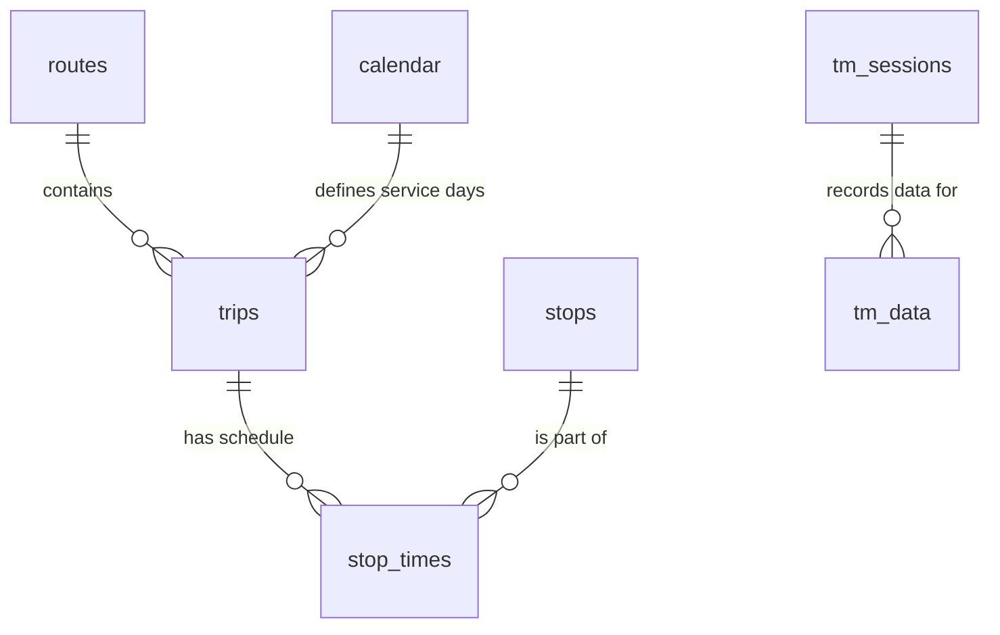

# Database & Modelli

Il sistema utilizza MySQL (o MariaDB) per la gestione dei dati dinamici, dei log e per alcune query spaziali/GTFS.

## Connettore Database (`app/models/databaseConnector.php`)

La classe `databaseConnector` è un wrapper attorno a `mysqli`. Fornisce metodi semplici per connettersi ed eseguire query.

### Funzione Particolare: `seamsValidSQL`
Il metodo `seamsValidSQL` viene utilizzato (anche se con una logica "invertita" nel codice attuale) per controllare se una query contiene parole chiave pericolose. **Nota**: Il sistema si affida principalmente a `addslashes` per la sanificazione, ma sarebbe preferibile passare a Prepared Statements (PDO) per una sicurezza completa.

---

## Schema del Database

### 1. Dati GTFS (Importati)
Queste tabelle contengono i dati statici dei trasporti ACTV.

-   **`stops`**: Fermate fisiche con coordinate geografiche.
-   **`stop_times`**: Orari di passaggio di ogni trip per ogni fermata.
-   **`trips`**: Singole corse (es. la corsa delle 08:30 della linea 5E).
-   **`routes`**: Linee (es. "5E", "7", "2").
-   **`calendar`**: Giorni di servizio per ogni `service_id`.

### 2. Monitoraggio & Logs (`logs`)
Memorizza errori e warning catturati dal sistema.
-   `type`: `PHP_ERROR`, `JS_ERROR`, `EXCEPTION`.
-   `context`: Campo JSON per dati aggiuntivi (es. User Agent, parametri richiesta).

### 3. Time Machine
-   **`tm_sessions`**: Sessioni di registrazione configurate.
    -   `stops`: JSON con la lista degli ID fermata da monitorare.
-   **`tm_data`**: Dati grezzi registrati.
    -   `data_json`: Il payload JSON ricevuto dall'API ACTV (longtext).

---

## Relazioni Principali

## Esempio di Query Tipica
Per trovare la posizione di un bus tra due fermate:
1.  Si ottengono i `stop_times` per un `trip_id`.
2.  Si uniscono con la tabella `stops` per avere le coordinate.
3.  Si ordina per `stop_sequence`.
