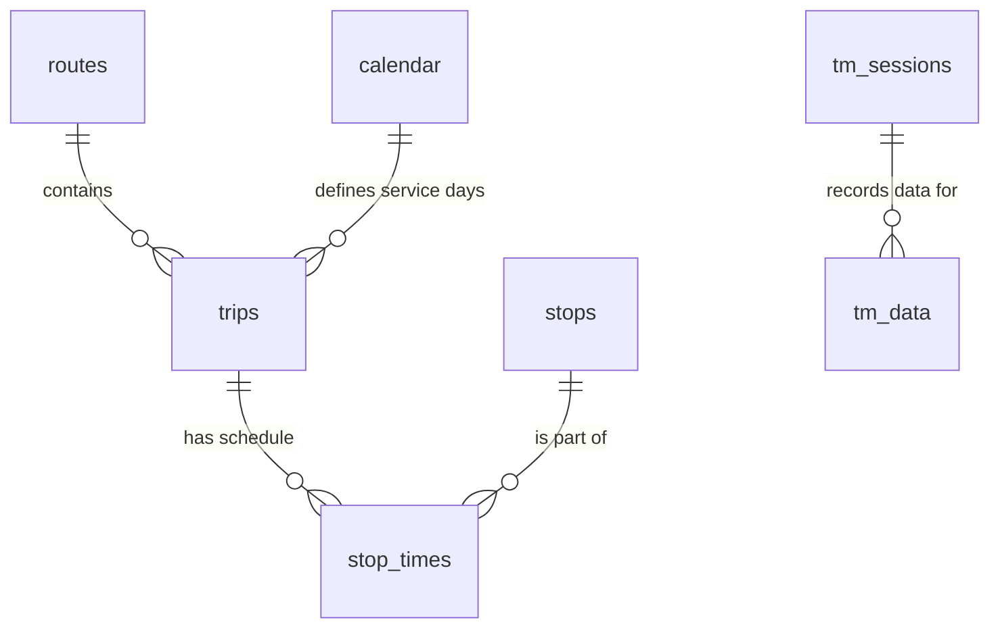

# Database & Modelli

Il sistema utilizza MySQL (o MariaDB) per i dati GTFS, i log e le registrazioni
Time Machine. Lo schema dettagliato delle tabelle di trasporto, con tipi ed
esempi reali, è in [Database GTFS](gtfs-format.md).

## Connettore Database (`app/models/databaseConnector.php`)

La classe `databaseConnector` è un wrapper attorno a PDO. Usa prepared
statements con emulazione disabilitata e restituisce i risultati come array
associativi.

---

## Schema del Database

### 1. Dati GTFS (Importati)
Queste tabelle contengono i dati statici dei trasporti ACTV.

-   **`stops`**: Fermate fisiche con coordinate geografiche.
-   **`stop_times`**: Orari di passaggio di ogni trip per ogni fermata.
-   **`trips`**: Singole corse (es. la corsa delle 08:30 della linea 5E).
-   **`routes`**: Linee (es. "5E", "7", "2").
-   **`calendar`**: Giorni di servizio per ogni `service_id`.
-   **`calendar_dates`**: Aggiunte e rimozioni per date specifiche.
-   **`shapes`**: Punti geografici originali del feed.
-   **`shapes_refined`**: Copia applicativa delle shape usata dalle API mappa.

### 2. Monitoraggio & Logs (`logs`)
Memorizza errori e warning catturati dal sistema.
-   `type`: `PHP_ERROR`, `JS_ERROR`, `EXCEPTION`.
-   `context`: Campo JSON per dati aggiuntivi (es. User Agent, parametri richiesta).

### 3. Time Machine
-   **`tm_sessions`**: Sessioni di registrazione configurate.
    -   `stops`: JSON con la lista degli ID fermata da monitorare.
-   **`tm_data`**: Dati grezzi registrati.
    -   `data_json`: Il payload JSON ricevuto dall'API ACTV (longtext).

---

## Relazioni Principali

```mermaid
erDiagram
    routes ||--o{ trips : contains
    trips ||--o{ stop_times : "has schedule"
    stops ||--o{ stop_times : "is part of"
    calendar ||--o{ trips : "defines service days"
    tm_sessions ||--o{ tm_data : "records data for"
```

## Esempio di Query Tipica
Per trovare la posizione di un bus tra due fermate:
1.  Si ottengono i `stop_times` per un `trip_id`.
2.  Si uniscono con la tabella `stops` per avere le coordinate.
3.  Si ordina per `stop_sequence`.
