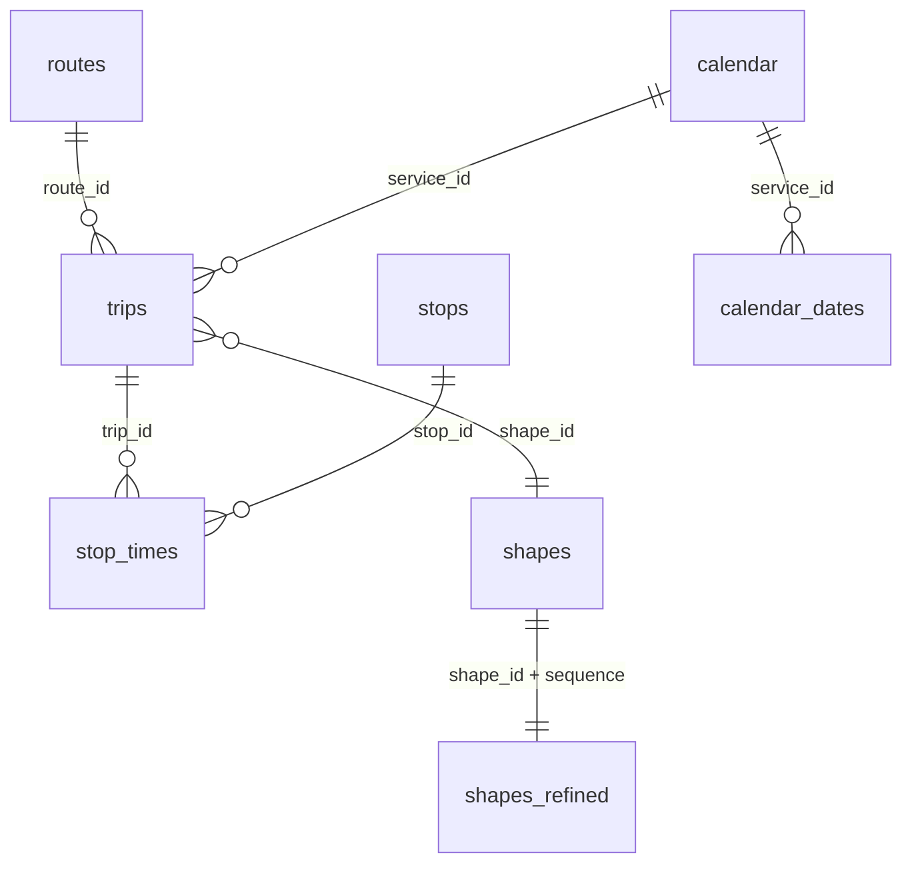

# Database GTFS

Questa pagina descrive il contenuto GTFS effettivamente importato nel database
MySQL/MariaDB di ACTV Live.

I tipi, i conteggi e gli esempi sono stati verificati sul database configurato
il **10 giugno 2026**. Il feed caricato copre il periodo dal **5 giugno 2026**
al **9 agosto 2026**. I conteggi cambiano a ogni aggiornamento.

## Panoramica

| Tabella | Righe rilevate | Origine | Contenuto |
|---|---:|---|---|
| `routes` | 97 | `routes.txt` | Linee e varianti commerciali |
| `trips` | 30.183 | `trips.txt` | Singole corse programmate |
| `stops` | 2.250 | `stops.txt` + ACTV real-time | Fermate e coordinate |
| `stop_times` | 693.658 | `stop_times.txt` | Orari di ogni corsa a ogni fermata |
| `calendar` | 3 | `calendar.txt` | Regole settimanali dei servizi |
| `calendar_dates` | 52 | `calendar_dates.txt` | Eccezioni per date specifiche |
| `shapes` | 702.240 | `shapes.txt` | Punti geografici dei percorsi |
| `shapes_refined` | 702.240 | derivata da `shapes` | Shape nel formato usato dalle API |

Il feed contiene anche `agency.txt` e `feed_info.txt`, ma la pipeline corrente
non li importa nel database. Le informazioni dell'operatore restano comunque
disponibili in `routes.agency_id`.

## Relazioni



Le relazioni GTFS sono applicate dalle query applicative, non da constraint
`FOREIGN KEY`. Nel database corrente:

- gli ID GTFS sono `VARCHAR(255)` per supportare identificatori non numerici;
- le colonne sono generalmente nullable perché i campi facoltativi vuoti del
  CSV vengono importati come `NULL`;
- non sono definite primary key sulle tabelle GTFS originali;
- sono presenti alcuni indici non univoci sulle colonne usate più spesso;
- `shapes_refined.id` è l'unica primary key tecnica di questo gruppo.

## `routes`

Una riga rappresenta una linea o variante di linea definita dal feed.

| Campo | Tipo DB | Significato |
|---|---|---|
| `route_id` | `varchar(255)` | Identificatore GTFS della rotta |
| `agency_id` | `varchar(255)` | Operatore; nel feed corrente è `ACTV` |
| `route_short_name` | `varchar(255)` | Nome mostrato all'utente, per esempio `5E` |
| `route_long_name` | `varchar(255)` | Descrizione estesa o coppia di capolinea |
| `route_desc` | `varchar(255)` | Categoria ACTV della linea |
| `route_type` | `int` | Tipo di mezzo GTFS |
| `route_url` | `varchar(255)` | URL informativo facoltativo |
| `route_color` | `varchar(255)` | Colore esadecimale senza `#` |
| `route_text_color` | `varchar(255)` | Colore del testo senza `#` |

Esempio:

```json
{
  "route_id": "11_UL",
  "agency_id": "ACTV",
  "route_short_name": "11",
  "route_long_name": "Santa Maria Elisabetta - Pellestrina Cimitero",
  "route_desc": "UL",
  "route_type": 3,
  "route_url": null,
  "route_color": "5B5B5B",
  "route_text_color": "FFFFFF"
}
```

Nel GTFS, `route_type = 3` indica un servizio autobus. I suffissi presenti in
`route_id` e i valori di `route_desc`, come `UL`, `UM`, `EN` ed `ES`, sono
codifiche specifiche del feed ACTV e non enumerazioni standard GTFS.

## `trips`

Una riga rappresenta una singola corsa di una rotta in uno specifico servizio.
Più corse possono condividere linea, destinazione e shape, ma hanno `trip_id`
distinti.

| Campo | Tipo DB | Significato |
|---|---|---|
| `route_id` | `varchar(255)`, indice | Collegamento logico a `routes.route_id` |
| `service_id` | `varchar(255)`, indice | Collegamento a `calendar.service_id` |
| `trip_id` | `varchar(255)` | Identificatore univoco della corsa nel feed |
| `trip_headsign` | `varchar(255)` | Destinazione mostrata al passeggero |
| `trip_short_name` | `varchar(255)` | Nome breve facoltativo della corsa |
| `direction_id` | `int` | Direzione `0` o `1`, relativa alla rotta |
| `block_id` | `varchar(255)` | Gruppo operativo di corse dello stesso mezzo |
| `shape_id` | `varchar(255)` | Collegamento logico ai punti di `shapes` |
| `wheelchair_accessible` | `varchar(255)` | Indicazione GTFS di accessibilità |

Esempio:

```json
{
  "route_id": "11_UL",
  "service_id": "AUT_90_660504_000",
  "trip_id": "AUT_ACTV_90_3352",
  "trip_headsign": "Pellestrina Cimitero",
  "trip_short_name": null,
  "direction_id": 0,
  "block_id": null,
  "shape_id": "AUT_90_1_0_1",
  "wheelchair_accessible": null
}
```

Il file sorgente contiene ulteriori campi proprietari. L'importatore inserisce
solo le colonne che esistono nella tabella DB, quindi campi come `note_id`,
`mean_duration_factor` o `boarding_type` non vengono conservati.

## `stops`

Una riga rappresenta una fermata o un punto GTFS.

| Campo | Tipo DB | Significato |
|---|---|---|
| `stop_id` | `varchar(255)` | Identificatore GTFS della fermata |
| `stop_code` | `varchar(255)` | Codice pubblico della fermata |
| `stop_name` | `varchar(255)`, indice | Nome visualizzato |
| `stop_desc` | `varchar(255)` | Descrizione facoltativa |
| `stop_lat` | `double` | Latitudine WGS84 |
| `stop_lon` | `double` | Longitudine WGS84 |
| `zone_id` | `varchar(255)` | Zona tariffaria |
| `stop_url` | `varchar(255)` | URL informativo facoltativo |
| `location_type` | `varchar(255)` | Tipo di punto GTFS |
| `parent_station` | `varchar(255)` | Stazione padre, se presente |
| `stop_timezone` | `varchar(255)` | Fuso orario specifico |
| `wheelchair_boarding` | `varchar(255)` | Accessibilità della fermata |
| `data_url` | `varchar(255)` | Estensione ACTV Live per il real-time |

Esempio:

```json
{
  "stop_id": "4",
  "stop_code": "4",
  "stop_name": "Torino Rossetto",
  "stop_desc": null,
  "stop_lat": 45.479889,
  "stop_lon": 12.250535,
  "zone_id": "48",
  "stop_url": null,
  "location_type": null,
  "parent_station": null,
  "stop_timezone": null,
  "wheelchair_boarding": null,
  "data_url": "4-1004-web-aut"
}
```

### Campo applicativo `data_url`

`data_url` non appartiene allo standard GTFS. Dopo l'import, la pipeline scarica
l'elenco fermate del servizio real-time ACTV e associa gli ID presenti nella
descrizione al relativo `stop_id`.

Un valore come:

```text
4-1004-web-aut
```

è il segmento usato in URL real-time quali:

```text
https://oraritemporeale.actv.it/aut/backend/passages/4-1004-web-aut
```

Più `stop_id` GTFS possono quindi condividere lo stesso `data_url`.

## `stop_times`

È la tabella più usata per gli orari. Ogni riga associa una corsa a una fermata
in una posizione precisa del percorso.

| Campo | Tipo DB | Significato |
|---|---|---|
| `trip_id` | `varchar(255)`, indice | Collegamento a `trips.trip_id` |
| `arrival_time` | `time` | Orario programmato di arrivo |
| `departure_time` | `time` | Orario programmato di partenza |
| `stop_id` | `varchar(255)`, indice | Collegamento a `stops.stop_id` |
| `stop_sequence` | `int` | Ordine crescente della fermata nella corsa |
| `stop_headsign` | `varchar(255)` | Destinazione eventualmente specifica da quel punto |
| `pickup_type` | `int`, indice | Regola di salita |
| `drop_off_type` | `int` | Regola di discesa |
| `shape_dist_traveled` | `varchar(255)` | Distanza lungo la shape, se fornita |

Esempio:

```json
{
  "trip_id": "AUT_ACTV_90_3",
  "arrival_time": "06:54:00",
  "departure_time": "06:54:00",
  "stop_id": "1284",
  "stop_sequence": 2,
  "stop_headsign": "VENEZIA",
  "pickup_type": null,
  "drop_off_type": 1,
  "shape_dist_traveled": null
}
```

Gli orari GTFS possono superare le 24 ore, per esempio `25:10:00`, per indicare
le 01:10 del giorno civile successivo mantenendo la corsa nel giorno di
servizio originale. Il tipo MySQL `TIME` conserva questi valori.

Valori standard principali per `pickup_type` e `drop_off_type`:

| Valore | Significato |
|---:|---|
| `0` o `NULL` | Servizio regolare |
| `1` | Salita o discesa non disponibile |
| `2` | Prenotazione telefonica richiesta |
| `3` | Coordinamento con il personale richiesto |

Il file ACTV contiene molte colonne GTFS estese, ma il database conserva solo
quelle elencate sopra.

## `calendar`

Definisce in quali giorni della settimana è normalmente attivo un
`service_id`, entro un intervallo di date.

| Campo | Tipo DB | Significato |
|---|---|---|
| `service_id` | `varchar(255)` | Identificatore del calendario |
| `monday` ... `sunday` | `int` | `1` attivo, `0` non attivo |
| `start_date` | `int` | Prima data valida in formato `YYYYMMDD` |
| `end_date` | `int` | Ultima data valida in formato `YYYYMMDD` |

Esempio:

```json
{
  "service_id": "AUT_90_660506_000",
  "monday": 1,
  "tuesday": 1,
  "wednesday": 1,
  "thursday": 1,
  "friday": 1,
  "saturday": 0,
  "sunday": 0,
  "start_date": 20260605,
  "end_date": 20260809
}
```

Questa riga indica un servizio feriale, attivo dal 5 giugno al 9 agosto 2026,
salvo eccezioni in `calendar_dates`.

## `calendar_dates`

Aggiunge o rimuove un servizio in una data specifica, prevalendo sulla regola
settimanale di `calendar`.

| Campo | Tipo DB | Significato |
|---|---|---|
| `service_id` | `varchar(255)` | Servizio interessato |
| `date` | `int` | Data in formato `YYYYMMDD` |
| `exception_type` | `int` | Tipo di eccezione |

Valori di `exception_type`:

| Valore | Significato |
|---:|---|
| `1` | Servizio aggiunto per la data |
| `2` | Servizio rimosso per la data |

Esempi:

```json
[
  {
    "service_id": "AUT_90_660503_000",
    "date": 20260607,
    "exception_type": 1
  },
  {
    "service_id": "AUT_90_660508_000",
    "date": 20260607,
    "exception_type": 2
  }
]
```

## `shapes`

Contiene le polilinee GTFS originali. Una shape è composta da molte righe con
lo stesso `shape_id`, ordinate per `shape_pt_sequence`.

| Campo | Tipo DB | Significato |
|---|---|---|
| `shape_id` | `varchar(255)` | Identificatore della polilinea |
| `shape_pt_lat` | `double` | Latitudine WGS84 del punto |
| `shape_pt_lon` | `double` | Longitudine WGS84 del punto |
| `shape_pt_sequence` | `int` | Ordine del punto |
| `shape_dist_traveled` | `double` | Distanza cumulativa lungo il percorso |

Esempio:

```json
[
  {
    "shape_id": "AUT_90_1_0_1",
    "shape_pt_lat": 45.41782,
    "shape_pt_lon": 12.368981,
    "shape_pt_sequence": 0,
    "shape_dist_traveled": 0
  },
  {
    "shape_id": "AUT_90_1_0_1",
    "shape_pt_lat": 45.417545,
    "shape_pt_lon": 12.368747,
    "shape_pt_sequence": 1,
    "shape_dist_traveled": 35.621532287172336
  }
]
```

Nel feed corrente la distanza appare espressa in metri. Il codice non deve
tuttavia assumere un'unità diversa da quella usata coerentemente dal feed.

## `shapes_refined`

Tabella applicativa derivata da `shapes`. Espone nomi di campo più comodi per
le API cartografiche e aggiunge una primary key numerica.

| Campo | Tipo DB | Vincoli | Significato |
|---|---|---|---|
| `id` | `int` | PK, auto increment | Identificatore tecnico del punto |
| `shape_id` | `varchar(255)` | indice | Shape di appartenenza |
| `lat` | `decimal(10,8)` | non nullo | Latitudine |
| `lng` | `decimal(11,8)` | non nullo | Longitudine |
| `sequence` | `int` | non nullo, indice | Ordine del punto |
| `dist_traveled` | `double` | nullable | Distanza cumulativa |

Esempio:

```json
[
  {
    "id": 1,
    "shape_id": "AUT_90_1_0_1",
    "lat": "45.41782000",
    "lng": "12.36898100",
    "sequence": 0,
    "dist_traveled": 0
  },
  {
    "id": 2,
    "shape_id": "AUT_90_1_0_1",
    "lat": "45.41754500",
    "lng": "12.36874700",
    "sequence": 1,
    "dist_traveled": 35.621532287172336
  }
]
```

La pipeline corrente copia i punti da `shapes`:

```sql
INSERT INTO shapes_refined
    (shape_id, lat, lng, sequence, dist_traveled)
SELECT
    shape_id,
    shape_pt_lat,
    shape_pt_lon,
    shape_pt_sequence,
    shape_dist_traveled
FROM shapes
ORDER BY shape_id, shape_pt_sequence;
```

Non viene eseguito un ulteriore algoritmo di map matching durante questa fase.

## Esempio di corsa completa

La query seguente collega linea, corsa, calendario, fermate e orari:

```sql
SELECT
    r.route_short_name,
    r.route_long_name,
    t.trip_id,
    t.trip_headsign,
    st.stop_sequence,
    s.stop_id,
    s.stop_name,
    st.arrival_time,
    st.departure_time
FROM trips t
JOIN routes r
    ON r.route_id = t.route_id
JOIN stop_times st
    ON st.trip_id = t.trip_id
JOIN stops s
    ON s.stop_id = st.stop_id
WHERE t.trip_id = 'AUT_ACTV_90_3352'
ORDER BY st.stop_sequence;
```

Per verificare se la corsa è attiva in una data, bisogna combinare:

1. il giorno settimanale e l'intervallo di `calendar`;
2. le aggiunte con `calendar_dates.exception_type = 1`;
3. le rimozioni con `calendar_dates.exception_type = 2`.

## Importazione

La pipeline amministrativa:

1. estrae i file GTFS;
2. crea tabelle di staging tramite `CREATE TABLE ... LIKE`;
3. converte gli ID GTFS principali in `VARCHAR(255)`;
4. importa solo le intestazioni CSV che corrispondono a colonne esistenti;
5. converte le stringhe vuote in `NULL`;
6. compila `stops.data_url`;
7. genera `shapes_refined`;
8. sostituisce atomicamente le tabelle pubblicate con `RENAME TABLE`.

Le tabelle importate sono definite in
`GtfsUpdateManager::TABLE_FILES`:

```text
routes
trips
stops
stop_times
calendar
calendar_dates
shapes
```

## File GTFS non importati

### `agency.txt`

Il feed corrente dichiara:

```json
{
  "agency_id": "ACTV",
  "agency_name": "ACTVs.p.a",
  "agency_url": "http://www.actv.it",
  "agency_timezone": "Europe/Rome",
  "agency_lang": "IT",
  "agency_phone": "+39041041",
  "agency_fare_url": "http://www.veneziaunica.it"
}
```

### `feed_info.txt`

```json
{
  "feed_id": "0",
  "feed_publisher_name": "ACTV S.p.a",
  "feed_publisher_url": "http://www.actv.it/",
  "feed_lang": "IT",
  "feed_start_date": "20260605",
  "feed_end_date": "20260809"
}
```

Questi dati sono disponibili nell'archivio estratto, ma non hanno una tabella
runtime dedicata.
