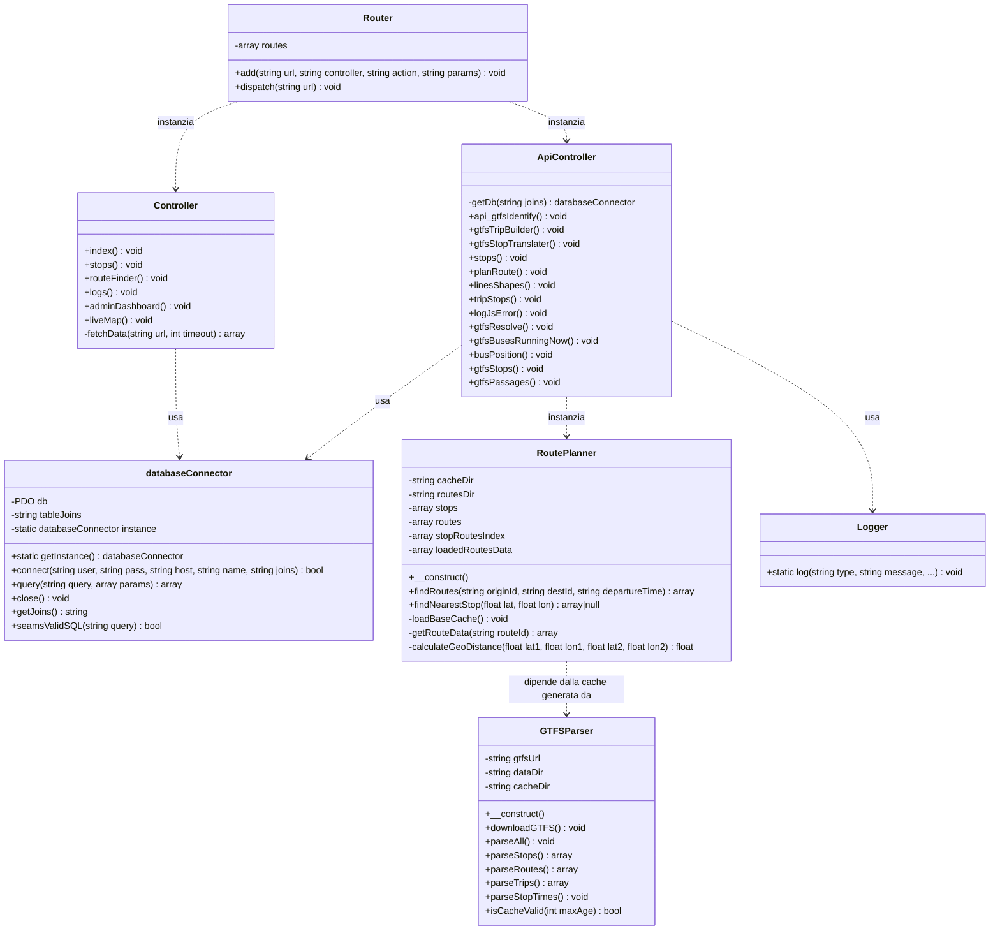

# Progetto ACTV Live - UML Diagram

Questo documento contiene la rappresentazione UML del progetto utilizzando la sintassi Mermaid.

## Diagramma delle Classi

## Descrizione dei Componenti

- **Router**: Gestisce il routing delle richieste HTTP verso i controller appropriati.
- **Controller**: Gestisce le viste principali dell'applicazione e le operazioni amministrative.
- **ApiController**: Fornisce endpoint per le funzionalità dinamiche (GTFS, pianificazione percorsi, posizioni bus).
- **databaseConnector**: Implementa il pattern Singleton per gestire la connessione al database tramite PDO.
- **RoutePlanner**: Logica di ricerca percorsi (diretti e con cambi) basata su dati GTFS pre-elaborati.
- **GTFSParser**: Utility per scaricare e convertire i file GTFS in cache JSON ottimizzate.
- **Logger**: Utility statica per la registrazione di log ed errori.
